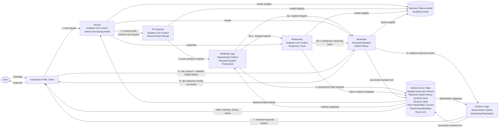

# AirGap LLM — Plan

## Purpose

This project simulates how a **third-party AI provider** can reduce the exposure of sensitive user data while still using a language model.

The Gated path detects sensitive strings, replaces them with neutral placeholders, processes the masked request, and restores the original values only when presenting the result.

The Gatekeeper layer consists of:

- an LLM-based **PII Detector**;
- deterministic Python **Masking Logic**;
- an in-memory **Session Vault**;
- deterministic Python **Restore Logic**.

The Router runs before the PII Detector to select the processing mode. Both the Router and PII Detector intentionally receive the current raw request.

Reasoning and Generator receive only masked data in the Gated path.

This architecture reduces downstream exposure but does not guarantee complete PII detection.

This is a **local educational simulation**, not a production security control.

## Prompt Engineering Approach

Each LLM role uses the same selected Ollama model weights but has its own system prompt and isolated context behavior.

| Context | File | Prompt constant |
|---|---|---|
| PII Detector | `server/gatekeeper.py` | `PII_DETECTOR_SYSTEM_PROMPT` |
| Router | `server/router.py` | `ROUTER_SYSTEM_PROMPT` |
| Reasoning | `server/router.py` | `REASONING_SYSTEM_PROMPT` |
| Generator | `server/router.py` | `GENERATOR_SYSTEM_PROMPT` |

Masking, placeholder assignment, Vault management, restoration, state commits, and rollbacks are implemented in Python and do not use LLM prompts.

Prompts are refined iteratively by:

1. testing model responses;
2. identifying failures;
3. updating the relevant role prompt;
4. re-testing against representative cases.

## Overview

The interface provides two request paths.

### Gated Path

```text
User
→ Router
→ PII Detector
→ Masking Logic
→ optional Reasoning
→ Generator
→ streaming Restore Logic
→ User
```

The Router always runs first.

The PII Detector runs after routing regardless of whether the selected mode is `instant` or `reasoning`, because every Gated request must be masked before reaching Reasoning or Generator.

### Direct Path

```text
User
→ Generator
→ User
```

The Direct path bypasses:

- PII Detector;
- Masking Logic;
- Router;
- Reasoning;
- Restore Logic.

It sends the current raw request directly to the Generator while including the existing masked Gated history as context.

The Direct request and response are temporary. They are displayed in the UI but are not added to:

- persistent Generator history;
- restored Gated history;
- Reasoning metadata;
- the Session Vault.

Direct responses are streamed without restoration.

## Terminology

The PII Detector, Router, Reasoning, and Generator are **role-specific LLM contexts** or **LLM processing modules**, not necessarily independent agents.

The Masking Logic and Restore Logic are deterministic Python modules.

The term **Gatekeeper layer** collectively refers to:

- PII Detector;
- Masking Logic;
- Session Vault;
- Restore Logic.

The Router is not part of the Gatekeeper layer, but it intentionally receives raw input before masking.

The application placeholders are not model tokenizer tokens.

### Note on Raw-Data Scope

The exposure-reduction boundary applies specifically to Reasoning and Generator in the Gated path.

The following components intentionally receive raw data:

- Router;
- PII Detector;
- Masking Logic;
- Restore Logic;
- Session Vault.

The following components receive only masked data:

- Reasoning;
- Generator during Gated requests.

The Direct path intentionally bypasses this protection boundary.

## Architecture



The FastAPI server executes Router and PII Detector sequentially.

The execution order is:

```text
Router completes
→ PII Detector starts
→ Masking starts
→ optional Reasoning starts
→ Generator starts
```

Actual model execution speed depends on:

- the selected Ollama model;
- Ollama configuration;
- available system memory;
- CPU or GPU resources;
- current model-loading state.

## Core Behavior

### Gated Request Lifecycle

A Gated request follows this lifecycle:

```text
1. Acquire the global busy lock
2. Create a request-scoped state transaction
3. Run Router
4. Run PII Detector
5. Validate Detector output
6. Register provisional Vault entries
7. Mask the current request
8. Run optional Reasoning
9. Run Generator
10. Restore the streamed response
11. Commit masked history
12. Commit restored history
13. Commit provisional Vault changes
14. Release the global busy lock
```

If the request fails before a successful Generator completion:

```text
1. Discard the partial response
2. Roll back provisional Vault changes
3. Do not update masked Generator history
4. Do not update restored Gated history
5. Release the global busy lock
6. Return a terminal error event
```

Router fallback and Reasoning fallback do not count as complete request failures.

## Router

The Router receives:

- the restored existing Gated history;
- the current raw user request.

It returns one of the following objects:

```json
{
  "mode": "instant",
  "reason": "The request can be answered directly."
}
```

```json
{
  "mode": "reasoning",
  "reason": "The request requires multi-step analysis."
}
```

The Router:

- runs before the PII Detector;
- intentionally receives raw input;
- does not select a model;
- does not return a difficulty label;
- does not maintain persistent LLM history;
- does not modify Generator history;
- does not modify the Session Vault.

Valid `mode` values are:

```text
instant
reasoning
```

The Router response must be valid JSON and match the expected schema.

### Router Failure Policy

Router attempts:

```text
initial attempt
→ retry 1
→ retry 2
```

There are at most three total attempts.

Retries occur immediately without delay.

A Router attempt fails when:

- it exceeds the 90-second timeout;
- the response cannot be parsed as JSON;
- the response does not match the required schema;
- `mode` is not `instant` or `reasoning`.

If all three attempts fail, the Router fails open:

```text
Router final failure
→ use mode "instant"
→ record fallback metadata
→ continue to PII Detector
```

## PII Detector

The PII Detector receives only the current raw user request.

It returns only exact strings that should be replaced.

```json
{
  "entities": [
    "John Doe",
    "user@example.com"
  ]
}
```

It does not:

- classify PII types;
- generate placeholders;
- assign placeholder numbers;
- modify the Vault;
- rewrite the input;
- return a masked request.

### Detector Validation

A valid Detector response must:

- be valid JSON;
- contain an `entities` array;
- contain only strings;
- contain only non-empty strings;
- contain strings that occur exactly in the current raw request.

Duplicate strings are removed while preserving their first occurrence order.

A response containing invalid entities is treated as a failed attempt.

### PII Detector Failure Policy

PII Detector attempts:

```text
initial attempt
→ retry 1
→ retry 2
```

There are at most three total attempts.

Retries occur immediately without delay.

A PII Detector attempt fails when:

- it exceeds the 90-second timeout;
- the response cannot be parsed as JSON;
- the response does not match the required schema;
- an entity is invalid;
- an entity is not an exact substring of the raw request.

If all three attempts fail, the PII Detector fails closed:

```text
PII Detector final failure
→ terminate the Gated request
→ roll back request-scoped changes
→ return an error
→ save no Gated turn
```

## Placeholder Format

Placeholders use neutral global numbering.

```text
[[PII_000001]]
[[PII_000002]]
[[PII_000003]]
```

Regular expression:

```regex
\[\[PII_\d{6}\]\]
```

The placeholder does not expose whether the original value is:

- a name;
- an email address;
- an organization;
- a URL;
- a phone number;
- an identifier;
- another sensitive string.

## Session Vault

The Vault is stored in global FastAPI server memory.

Example:

```json
{
  "[[PII_000001]]": "John Doe",
  "[[PII_000002]]": "user@example.com"
}
```

A reverse mapping is also maintained:

```json
{
  "John Doe": "[[PII_000001]]",
  "user@example.com": "[[PII_000002]]"
}
```

### Vault Rules

1. The Vault persists until the server process exits.
2. Committed Vault entries are not deleted during the prototype session.
3. A new exact string receives the next global placeholder number.
4. An existing exact string reuses its existing placeholder.
5. Committed placeholder numbers are never reused.
6. Matching is exact and case-sensitive.
7. Whitespace differences create separate entries.
8. Overlapping strings remain separate entries.
9. Once committed, a string continues to be masked even if the Detector later omits it.
10. Direct requests do not modify the Vault.

Because matching is case-sensitive, the following values are treated as separate entries:

```text
John Doe
john doe
JOHN DOE
```

### Request-Scoped Vault Transaction

New Vault entries are provisional until the Gated request completes successfully.

At the beginning of each Gated request, the server records the state required to reverse:

- newly added Vault mappings;
- newly added reverse mappings;
- changes to the next placeholder counter.

If Generator generation ultimately fails, the server rolls back only the provisional changes created by the current request.

Previously committed Vault entries remain unchanged.

Example:

```text
Committed next number: 000010
Current request provisionally assigns: 000010 and 000011
Generator fails permanently
Rollback occurs
Next committed number returns to: 000010
```

Numbers assigned only inside a rolled-back request are not considered committed or previously used. They may be assigned by a later successful request.

## Input Masking

Masking is performed by deterministic Python logic.

```text
1. Protect user-written placeholder-like strings
2. Find committed Vault values in the raw input
3. Validate newly detected strings
4. Reuse existing placeholders
5. Register new strings provisionally
6. Order replacements deterministically
7. Replace matching strings
8. Restore protected literal strings as literals
9. Return the masked request
```

Existing committed Vault values are always masked, regardless of the current Detector result.

Example:

```text
Original:
Please contact John Doe at user@example.com.

Masked:
Please contact [[PII_000001]] at [[PII_000002]].
```

### Overlapping Strings

Overlapping strings are stored as separate Vault entries.

During masking, matching values are processed longest-first to prevent a shorter string from corrupting a longer match.

Example Vault values:

```text
John
John Doe
```

Example input:

```text
Contact John Doe.
```

The longer value is replaced first.

## Literal Placeholder Protection

A user may intentionally enter:

```text
[[PII_000001]]
```

This must not automatically be interpreted as an active Vault reference.

The server temporarily protects user-written placeholder-like text through a request-scoped Literal Map before applying normal masking and restoration.

Literal protection applies only to the current request and does not create Vault entries.

## Reasoning

Reasoning runs only when the Router selects:

```text
reasoning
```

It receives the masked current request and generates an explicit reasoning trace.

For a Reasoning request, it may also receive the persistent masked Gated history required for context.

The trace:

- is passed temporarily to the Generator;
- is not added to Generator history;
- is stored in server metadata;
- is linked to the corresponding Gated message for UI inspection.

Reasoning does not generate the final user response.

### Reasoning Failure Policy

Reasoning has a fixed timeout of 300 seconds.

Reasoning is executed once per Gated request.

If Reasoning:

- times out;
- returns an error;
- terminates unexpectedly;
- produces no usable trace;

the server falls back to instant generation.

```text
Reasoning failure
→ discard incomplete reasoning trace
→ record failure metadata
→ run Generator without a reasoning trace
```

A Reasoning failure does not terminate the Gated request.

## Generator History

Generator is the only LLM context with persistent conversational history.

For successful Gated requests, it stores:

```text
masked user message
masked assistant response
```

It does not store:

- restored messages;
- Router output;
- Reasoning traces;
- Direct requests;
- Direct responses;
- failed Gated attempts;
- partial Generator responses.

For a successful Reasoning request, Generator receives:

```text
persistent masked Gated history
+ temporary reasoning trace
+ current masked request
```

For an Instant request or Reasoning fallback, Generator receives:

```text
persistent masked Gated history
+ current masked request
```

Only the masked user request and the successfully completed masked response are appended afterward.

## Restored Gated History

The server maintains a separate **Restored Gated History** cache in memory.

It is distinct from persistent masked Generator history.

The restored cache contains successful user-facing Gated turns:

```text
raw or restored user message
restored assistant response
```

The cache is updated incrementally after each successful Gated request.

It is used only for:

- Router input;
- UI history rendering;
- educational inspection.

It is never provided to:

- Reasoning;
- Generator during a Gated request;
- the Direct response history store.

Direct exchanges are not added to the restored Gated history.

If a Gated request fails, no restored turn is added.

## Streaming Restoration

Generator calls use Ollama streaming.

```text
Ollama stream
→ FastAPI StreamingResponse
→ browser fetch()
→ ReadableStream
→ NDJSON parser
→ incremental UI rendering
```

SSE and WebSocket are not used.

For Gated responses:

- ordinary text is emitted immediately;
- possible placeholder prefixes are temporarily buffered;
- a complete known placeholder is restored from the Vault;
- an invalid candidate is emitted as ordinary text;
- a valid but unknown placeholder remains unchanged.

Example:

```text
Generator stream:
Contact [[PII_000001]].

UI output:
Contact John Doe.
```

Generator history stores the original masked response, not the restored UI output.

Direct responses are streamed without restoration.

## NDJSON Stream Protocol

All streamed endpoints use **Newline-Delimited JSON**.

Content type:

```text
application/x-ndjson; charset=utf-8
```

Each event is one complete JSON object followed by a newline.

Example:

```json
{"type":"status","stage":"router","state":"started"}
{"type":"status","stage":"router","state":"completed","mode":"reasoning"}
{"type":"status","stage":"pii_detector","state":"started"}
{"type":"delta","text":"Hello"}
{"type":"delta","text":" John Doe"}
{"type":"done","saved":true}
```

The browser:

1. reads byte chunks from `ReadableStream`;
2. decodes them as UTF-8;
3. buffers incomplete lines;
4. parses each completed line as JSON;
5. updates the UI according to the event type.

### Event Types

#### Status

Reports processing-stage changes for UI animation.

```json
{
  "type": "status",
  "stage": "pii_detector",
  "state": "started"
}
```

Possible stages include:

```text
router
pii_detector
masking
reasoning
generator
restoration
commit
```

#### Delta

Contains incremental response text.

```json
{
  "type": "delta",
  "text": "partial response text"
}
```

For Gated requests, `text` contains restored output.

For Direct requests, `text` contains raw Generator output.

#### Retry

Reports an immediate retry.

```json
{
  "type": "retry",
  "component": "generator",
  "attempt": 2,
  "max_attempts": 3
}
```

#### Reset

Instructs the UI to discard the currently displayed partial assistant response before a Generator retry.

```json
{
  "type": "reset",
  "target": "assistant_response"
}
```

#### Fallback

Reports a non-terminal fallback.

```json
{
  "type": "fallback",
  "component": "reasoning",
  "mode": "instant",
  "reason": "timeout"
}
```

Router final failure may also produce:

```json
{
  "type": "fallback",
  "component": "router",
  "mode": "instant",
  "reason": "retry_exhausted"
}
```

#### Error

Reports a terminal request failure.

```json
{
  "type": "error",
  "code": "PII_DETECTOR_FAILED",
  "message": "PII detection failed after three attempts."
}
```

An `error` event is terminal. No `done` event follows it.

#### Done

Reports successful completion.

```json
{
  "type": "done",
  "saved": true
}
```

For Direct requests:

```json
{
  "type": "done",
  "saved": false
}
```

Exactly one `done` event is emitted after a successful request.

## Global Request Lock

The prototype assumes:

- one user;
- one browser client;
- one global server session;
- one active request at a time.

While a request is active, the system blocks:

- new Gated requests;
- new Direct requests;
- repeated submissions;
- model changes;
- conflicting state mutations.

The server enforces a global busy lock.

The UI also disables affected controls.

The lock is released after:

- successful completion;
- terminal error;
- retry exhaustion;
- client disconnect;
- unexpected failure.

The lock must be released through guaranteed cleanup logic such as a `finally` block.

## Retry and Timeout Policy

| Component | Attempts | Timeout | Final failure behavior |
|---|---:|---:|---|
| Router | 3 | 90 seconds per attempt | Fall back to `instant` |
| PII Detector | 3 | 90 seconds per attempt | Fail closed and terminate request |
| Reasoning | 1 | 300 seconds | Fall back to Generator without reasoning |
| Generator | 3 | 120-second idle timeout per attempt | Terminate request and save no Gated turn |

Retries occur immediately without delay.

There is no end-to-end request timeout.

The Generator timeout is an **idle timeout** measured from the most recent received stream data. It is not a total generation-duration limit.

A request may therefore take more than ten minutes when several component attempts time out.

A Generator stream that continues producing data may run longer because no total request-duration limit is applied.

## Generator Retry Policy

A Generator attempt fails when:

- no stream data is received for 120 seconds;
- the stream terminates unexpectedly;
- Ollama returns a terminal generation error.

Generator attempts:

```text
initial attempt
→ retry 1
→ retry 2
→ final error
```

There are at most three total attempts.

Before each retry:

1. discard the partial masked response;
2. discard the restoration buffer;
3. emit a `reset` event;
4. clear the partial UI response;
5. emit a `retry` event;
6. restart generation from the beginning.

The retry reuses:

- the current request-scoped Vault state;
- the Router result;
- the completed Reasoning trace, when available;
- the Reasoning fallback result, when applicable;
- the persistent masked Gated history from before the request.

Persistent histories are updated only after one attempt completes successfully.

If all attempts fail:

- the request returns a terminal error;
- no masked Gated turn is saved;
- no restored Gated turn is saved;
- provisional Vault changes are rolled back;
- the global busy lock is released.

## State Commit Rules

A successful Gated request commits all of the following together:

- provisional Vault mappings;
- reverse Vault mappings;
- the next placeholder counter;
- the masked user message;
- the masked assistant response;
- the restored user message;
- the restored assistant response;
- Reasoning trace or fallback metadata.

A failed Gated request commits none of the following:

- provisional Vault mappings;
- masked Generator history;
- restored Gated history;
- partial assistant responses.

Failure metadata may be retained separately for educational debugging, provided it contains no unintended restored sensitive values.

Direct requests never modify persistent conversation or Vault state.

## Sub-Tasks

### Task 1 — Project Scaffold

**Intent**: Create the initial project structure.

**Todo List**:

1. Create `server/requirements.txt`
2. Create the FastAPI entry-point stub
3. Create `client/index.html`
4. Create setup instructions in `README.md`

**Status**: [x] done

---

### Task 2 — Gatekeeper Module

**Intent**: Implement PII detection, persistent Vault management, transactional masking, and restoration.

**Todo List**:

1. Implement `PII_DETECTOR_SYSTEM_PROMPT`
2. Implement `detect_entities()`
3. Implement Detector JSON parsing and schema validation
4. Implement three-attempt Detector retry handling
5. Implement the 90-second Detector timeout
6. Implement fail-closed Detector behavior
7. Implement the global Vault and reverse Vault
8. Implement global placeholder numbering
9. Implement exact-string reuse
10. Implement automatic masking of committed Vault values
11. Implement case-sensitive matching
12. Implement deterministic longest-first replacement
13. Implement literal placeholder protection
14. Implement request-scoped provisional Vault entries
15. Implement Vault commit and rollback
16. Implement full-text restoration
17. Implement streaming restoration
18. Implement Restored Gated History support
19. Add strict validation and error handling
20. Expose Vault state to the educational UI

**Status**: [ ] pending

---

### Task 3 — FastAPI Server

**Intent**: Coordinate the processing modules, maintain global state, and expose streamed Gated and Direct endpoints.

**Expected Endpoints**:

- `POST /chat/gated`
- `POST /chat/direct`
- `GET /models`

**Todo List**:

1. Implement the global application state
2. Implement the global busy lock
3. Execute Router before PII Detector
4. Implement Router parsing and schema validation
5. Implement Router retries and the 90-second timeout
6. Implement Router fail-open fallback to `instant`
7. Implement PII Detector retries and fail-closed behavior
8. Implement optional Reasoning
9. Implement the 300-second Reasoning timeout
10. Implement Reasoning fallback to `instant`
11. Implement persistent masked Generator history
12. Implement Restored Gated History
13. Implement incremental restored-history updates
14. Implement request-scoped Vault transactions
15. Implement streamed Gated responses
16. Implement streamed Direct responses
17. Implement NDJSON event framing
18. Implement Generator retries
19. Implement the 120-second Generator idle timeout
20. Reset partial responses before Generator retries
21. Commit Gated state only after successful completion
22. Roll back provisional Vault changes after terminal failure
23. Handle timeouts, disconnects, and Ollama errors
24. Always release the global busy lock

**Status**: [ ] pending

---

### Task 4 — Interactive Frontend UI

**Intent**: Build a single-page educational interface centered on the architecture diagram.

**Expected Outcomes**:

- one `client/index.html` file;
- no framework or build process;
- interactive architecture nodes;
- node-level input and output inspection;
- animated sequential request flow;
- Router-first highlighting;
- PII Detector highlighting after Router completion;
- optional Reasoning highlighting;
- streamed Gated and Direct responses;
- NDJSON stream parsing;
- partial-line buffering;
- response reset handling during Generator retries;
- retry, fallback, error, and completion indicators;
- visible Session Vault;
- persistent masked Generator history;
- restored user-facing Gated history;
- message-linked Reasoning traces;
- visible Reasoning fallback metadata;
- latest ephemeral Direct exchange;
- model selector;
- global busy-state controls;
- a warning that failed requests may take more than ten minutes on slow hardware.

**Status**: [ ] pending

---

### Task 5 — Model Selection and Prompt Tuning

**Intent**: Select a suitable local Ollama model and refine the four LLM prompts after the core architecture is implemented.

Evaluate:

- strict JSON reliability;
- exact-string PII detection;
- Router consistency;
- Reasoning quality;
- placeholder preservation;
- Generator response quality;
- streaming stability;
- retry behavior;
- timeout behavior;
- speed;
- memory usage.

Document:

- the selected model;
- final prompt constants;
- Ollama parallel-request configuration;
- known limitations;
- representative successful cases;
- representative failed cases;
- fallback behavior;
- case-sensitive Vault behavior.

Known limitations must include:

> Vault matching is case-sensitive. Different capitalization or whitespace for the same real-world entity creates separate Vault entries.

Example:

```text
John Doe
john doe
John  Doe
```

These values are tracked independently.

**Status**: [ ] pending

## Deferred Decisions

Model selection behavior, model-change API, and model loading under the global busy lock will be finalized in Task 5.